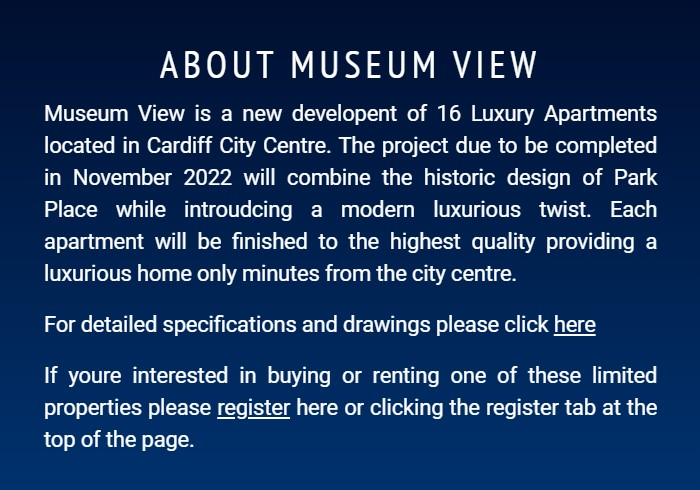
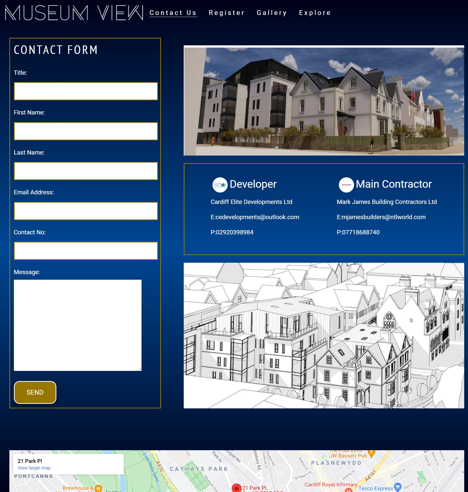

# Museum View

Museum View is a site that will be used to inform and register potential buyers and renter for a new development of 16 Luxury apartments located in Cardiff City Centre. The website will provide information regarding the project in the form of text, video and images and will allow clients to register their interest or contact the developers if they have any questions. Plans to develop the webiste futher to allow confirmed buyers and renters to track the progress of the project and get infromations and important dates.

The user will enter the website if looking to find information on project or if they would like to register their interest in the project and would like to buy or rent one of the properties they can do this easilly by completing a short form which is titled register interest.

## User Stories
A user would use the website if they seen an ad or drove past the development and seen the hoarding and wanted to find out more information on the project. The woudld come to the home page and click explore which would lead them to explore page which contains some text which has more information and includes links to drawings. A video showing a tour of the a potential apartment. They could then chose to register their interest 

A user would use the website if they wanted to contact the builder or developer of the project if they potenially had a complaint or wanted similar projected completed or just wanted a quote they could easily do this by clicking on the contact us page where they could choose to fill out a form or the direct details for the developer and builer are shown if their is an emergency.

A user would use the webiste if they already had the information they wanted and wanted to express the interest in renting or buying a property they could simply do this by clicking the register buttom and fill out the form.

In future models of the website the user would come back to log into the website to get updates and see progress of the development.
## Features 

- __Navigation Bar__

  - Featured on all three pages, the full responsive navigation bar includes links to the Exlpore page via the logo, Explore, Register and Contact Us page and is identical in each page to allow for easy navigation.
  - This section will allow the user to easily navigate from page to page across all devices without having to revert back to the previous page via the ‘back’ button. 

- __The landing page image__

  - The Landing image will be a image of the development logo to help create and promote the brand. 
  - This section will contain a button which states 'explore' to take users to the explore page. This will help give the feeling of exclusivity when entering the website.
  - This section will contain an aniamtion of the logo zooming into to draw attention from the user and enhance the brand futher.

- __The Footer__ 

  - The footer section includes links to the relevant social media sites for Museum View. The links will open to a new tab to allow easy navigation for the user. 
  - The footer is valuable to the user as it encourages them to keep connected via social media.
  -The footer also includes some standard copyright text

- __Explore Page__

  - The explore page will give the user more information about the project and the infromation will be shown in a variety of formats.
  
  - There is a small text paragraph giving a breif description of the project / sales pitch, within the paragraph there are two links one which will take the use to the register page and another which will take the user to a new page which will be a drop box page containing the plans of the project which should help the user easily find this information.

  

  - There is also an embbeded youtube video on the page that will allow the user to watch a video of a tour of an apartment. The user will be able to watch the video while on the page or clicking the title and going to youtube and going to a new page. The video used is https://www.youtube.com/watch?v=8xML0q0-mYI&t=60, this video was used as the Musuem View video was not completed in time.

  - The last section of this page will be Three features which have been created by using Font Awesome to creat larger icons followed by some text to give a brief description of the feature. The Gallery was going to follow these however. I think this may have been two much information on one page so the gallery has its own page.

  

- __Gallery Page__

  - The gallery page allows the client to see a lot of images in a small place. Due to the nature of the project being HTML and CSS only I used a bootstrap to create the carousel. I then edited the code to include my own imgaes and also added a feature to show a title and small description of the image for users to see.
  

- __Register Page__

  - This page will allow the user to register if they would like to express interest in buying or renting a property it will also allow the business gather information to see how desirable the properties are and can help use the figures to negotiate with other suppliers.  The Page containt a form to gather the information, an image and some benefits of the project to help prompt the user fill in the form if they have any doubts.

- __Contact Us Page__

- The contact us page will allow the user to contact the webiste via a contact form if they have any questions about the project that they couldnt find the answers to. This page will also incluse some direct contact inforamation to the builder and developer incase there is a need for an emergency contact. There is a google map emebedded at the bottom of this page so the user can easily use this to see the exact location of the project.

### Features Left to Implement

- Future Features could include a log in for approved buyers and renters to check on progress of the project and recieve relevent information and documents.
- A general progress bar could be added to the website.

## Testing 
Please see wireframe-images folder within the images folder for images of wireframes completed at the start of the project.
Please see [testing.md](/testing.md) for Testing

## Deployment

This section should describe the process you went through to deploy the project to a hosting platform (e.g. GitHub) 

- The site was deployed to GitHub pages. The steps to deploy are as follows: 
  - In the GitHub repository, navigate to the Settings tab 
  - From the source section drop-down menu, select the Master Branch
  - Once the master branch has been selected, the page will be automatically refreshed with a detailed ribbon display to indicate the successful deployment. 

The live link can be found here - https://alexxjamess.github.io/museum-view/

## Credits 

### Content 

- The icons in the footer and for the features on the explore page were taken from [Font Awesome](https://fontawesome.com/)

- The bootstrap for the carousel was from [get boot strap](https://getbootstrap.com/docs/4.0/components/carousel/)
- The map was obtained through [google](https://www.google.com/maps?ll=51.485058,-3.175836&z=16&t=m&hl=en&gl=GB&mapclient=embed&cid=1162786141127752078)
- the animated zoom was based of previous work completed on the love running project.
- The bullet points on the register page where based on a video found on [Youtube](https://www.youtube.com/watch?v=w7xKQ63DnDk)
- The submit and register button were created use ideas from [W3Schools](https://www.w3schools.com/css/css3_buttons.asp)
### Media

- The photos used on the gallery were from [Pexels](https://www.pexels.com/search/luxury%20apartment%20building/) these will be replaced with images of the actual project once they become available.

- Museum View Logo was created by myself along with logo for contact details of developer and contractor.

- The embedded video on the explore page is from [Youtube](https://www.youtube.com/watch?v=8xML0q0-mYI&t=60) this will also be replaced by the actual project video once it becomes available.

- The bootstrap for the carousel was from [get boot strap](https://getbootstrap.com/docs/4.0/components/carousel/)
- The map was obtained through [google](https://www.google.com/maps?ll=51.485058,-3.175836&z=16&t=m&hl=en&gl=GB&mapclient=embed&cid=1162786141127752078)

