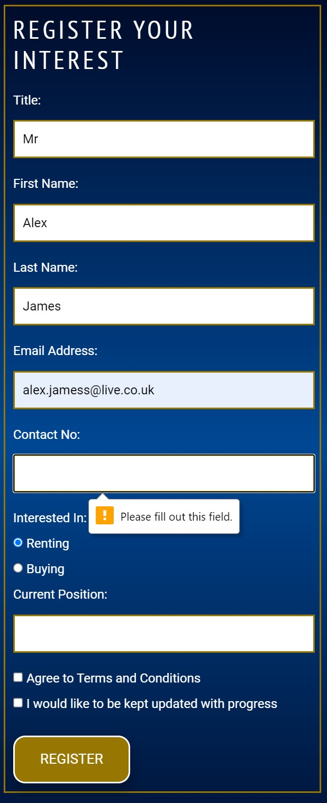

# Testing

I have tested both HTML and CSS for all pages and shown the results below.

When completing the project I came across one major bug which was due to myself creating new workspaces each time i worked on the project this caused some issue when it came to working on latest versions, but this was resolved and corrected mid-way through the project.

Other issues I came across was when making the website responsive for mobile devices and other screens. I believe this issue came from using fixed heights and floats, I then removed the fixed height and used 'display:flex" instead of floats and the website become much more responsive.

I also had some legibility issues with the colour scheme I had chosen, I used [Color Tool](https://material.io/resources/color/#!/?view.left=1&view.right=1&primary.color=977702&secondary.color=004793&secondary.text.color=92cc00) to find this out and then opted for a white colour text to make it more legible.

## Features Testing 
### Index
#### Navigation Bar
- Explore, Gallery, Register and Contact Us Page all work correctly taking user to correct page without opening a new window.
#### Logo
- Image when clicked works correctly taking user to home/index page.
#### Main Image
- Logo has zoom in amination as expected
#### Explore Button 
- Explore Button Works correctly taking user to explore page without opening a new window.
- Explore Button Changes shade when hovering over as expected.
- Explore Button Gives animation of Depressing once clicked as expexted.
#### Social Media Buttons 
- Facebook Icon takes user to facebook home page in new window as expected as musuem view facebook account not active. 
- Instagram Icon takes user to Instagram home page in new window as expected as musuem view Instagram account not active. 
- Twitter Icon takes user to Twitter home page in new window as expected as musuem view Twitter account not active. 
### Explore
#### Navigation Bar
- Explore, Gallery, Register and Contact Us Page all work correctly taking user to correct page without opening a new window.
#### Logo
- Image when clicked works correctly taking user to home/index page.
#### Links In Paragraph
- Links to architectual drawings opens dropbox link in new window as expected
- link to register page opens page without opening new window as expected 
#### Embedded Youtube Video
- Video Plays while embedded once clicked and starts from 1:00 minute mark as expected
- Video opens in new window once clicked on youtube logo or title as expcted

#### Social Media Buttons 
- Facebook Icon takes user to facebook home page in new window as expected as musuem view facebook account not active. 
- Instagram Icon takes user to Instagram home page in new window as expected as musuem view Instagram account not active. 
- Twitter Icon takes user to Twitter home page in new window as expected as musuem view Twitter account not active. 
### Gallery
#### Navigation Bar
- Explore, Gallery, Register and Contact Us Page all work correctly taking user to correct page without opening a new window.
#### Logo
- Image when clicked works correctly taking user to home/index page.
#### Carousel 
- Buttons to go to next and previous slides work as expected
- Tabs to pick an image work as expected 
- All images are shown 
- All captions are shown 
#### Social Media Buttons 
- Facebook Icon takes user to facebook home page in new window as expected as musuem view facebook account not active. 
- Instagram Icon takes user to Instagram home page in new window as expected as musuem view Instagram account not active. 
- Twitter Icon takes user to Twitter home page in new window as expected as musuem view Twitter account not active. 
### Register 
#### Navigation Bar
- Explore, Gallery, Register and Contact Us Page all work correctly taking user to correct page without opening a new window.
#### Logo
- Image when clicked works correctly taking user to home/index page.
#### Register Form 
- Title Field Contains Populated Dropdown as expected
- First Name Field works as expected error shown when not entered see image 1 below
- Last Name Field works as expected error shown when not entered see image 2 below
- Email Field works as expected error shown when not entered error also shown when a valid email entered see image 3 below
- Contact No field works as expected error shown when not entered also limit on number of digit that can be entered.
- Current Position Field containts populated drop down as expected
- Agreeing to terms and conditon also shows an error when not click- there is currently no link to the terms and conditions as these are not available.
- Register Button Changes shade when hovering over as expected.
- Register Button Gives animation of Depressing once clicked as expexted.
- Once clicking register it will currently show the data this is for examination purposes only. On completeing there will be a thankyou message and data will be sent to a spreadsheet.

>

#### Benfits
- The benefits bullet points have an error where the image is not being shown so a standard bullet point is shown instead.

#### Social Media Buttons 

- Facebook Icon takes user to facebook home page in new window as expected as musuem view facebook account not active. 
- Instagram Icon takes user to Instagram home page in new window as expected as musuem view Instagram account not active. 
- Twitter Icon takes user to Twitter home page in new window as expected as musuem view Twitter account not active. 

### Contact Us
#### Navigation Bar
- Explore, Gallery, Register and Contact Us Page all work correctly taking user to correct page without opening a new window.
#### Logo
- Image when clicked works correctly taking user to home/index page.
#### Contact Us Form 
- Title Field Contains Populated Dropdown as expected
- First Name Field works as expected error shown when not entered 
- Last Name Field works as expected error shown when not entered 
- Email Field works as expected error shown when not entered error also shown when a valid email entered see image 3 belo
- Contact No field works as expected error shown when not entered also limit on number of digit that can be entered.
- Message Field - Error found when running this test as there was validation to make it a required field. This has no been resolved.
- Send Button Changes shade when hovering over as expected.
- Send Button Gives animation of Depressing once clicked as expexted.
- Once clicking Send it will currently show the data this is for examination purposes only. On completeing there will be a thankyou message and data will be sent to a spreadsheet

#### Contact Details
- The image next to Developer details currently just loops as the developer website is not currently live.
- The image next to the main contractor details works as expected taking the user to the contractors website opening a new window.

#### Map
- The embedded map is interactive and opens in new window as expected when clicking to view larger map.

#### Social Media Buttons 

- Facebook Icon takes user to facebook home page in new window as expected as musuem view facebook account not active. 
- Instagram Icon takes user to Instagram home page in new window as expected as musuem view Instagram account not active. 
- Twitter Icon takes user to Twitter home page in new window as expected as musuem view Twitter account not active. 

## Validator Testing 

### HTML - Index
  - After running through [W3C validator](vl). The index page had the following errors which were reticfied. 
  
  - No errors were returned when passing through the official on Test 2 [W3C validator](https://validator.w3.org/l)

### HTML - Explore
 - After running through [W3C validator](https://validator.w3.org/l). The following errors were shown . 
  
  - On test 2 all issuues were recitifed other than those shown below, the error states that there is nothing in the heading however there is a font awesome text item which the validator isnt recognising.  [W3C validator](https://validator.w3.org/l)
  

### HTML - Gallery
  After running through [W3C validator](https://validator.w3.org/).There were no errors found.

### HTML - Register
 - After running through [W3C validator](https://validator.w3.org/). The following errors were shown . 
  
  - Error 1 was caused due to a button function being used by removing the button and changing it to an input this resolved this issue. Also there was a typing mistake on the word 'submit'
  - Erros 2-3 was caused to due the h2 and p element being inside the ul these were moved outside the ul and error was fixed.
  - Error 4 was a simple double closing tag, this was removed.
  - Erorr 5 was due to for attribute and element id being different. These were both changed to be the same 'tel'
  - On test 2 all issuues were recitifed 

### HTML - Contact Us
 - After running through [W3C validator](https://validator.w3.org/). The following errors were shown . 
  
  - Error 1 was caused due to a button function being used by removing the button and changing it to an input this resolved this issue. Also there was a typing mistake on the word 'submit'
  - Errors 2-9 where caused froma span element being used, changing this to a div elemenet resolved these issues.
  - Error 11 was a simple double closing tag, this was removed.
  - Error 10 was resolved by adding a Find Us Heading above the map.
  - Erorr 12 was due to for attribute and element id being different. These were both changed to be the same 'tel'

  - On test 2 all issuues were recitifed
### CSS - 
  - Only one error was found when running me style.css through the validator [(Jigsaw) validator](https://jigsaw.w3.org/css-validator/validator) This error was caused due to typing being entered in the code rather than the terminal. This had now been removed completely as this code was not needed.

### Responsiveness 
- Using Google Dev Tools to test the website or a range of devices using the ipad and pixel2 as the main marker i was able to get most items responsives, to tidy up any elements I then used some media queries based on two different screen widths to fix any other issues.

### Unfixed Bugs
- There is still a bug on the register page where the bullet points on the benefits section just show a standard bullet point and not an image of the museum. I have been unable to fix this issue. The bullet points did work but stopped unexpectedly

